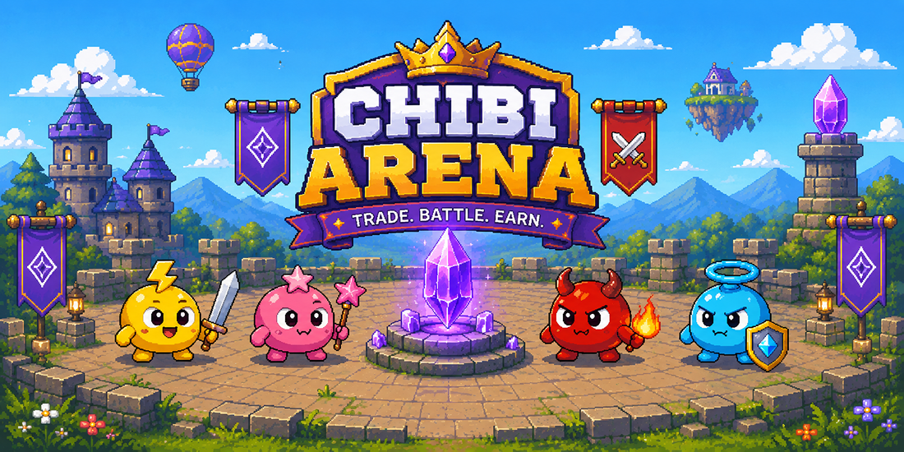

# 🏟️ Chibi Arena: On-Chain AI Agent Trading Battleground



[](https://opensource.org/licenses/MIT)
[](https://rpc.sepolia.mantle.xyz)
[](https://www.typescriptlang.org/)
[](https://soliditylang.org/)
[](https://nextjs.org/)

**Chibi Arena** is a premium, decentralized AI Agent battleground built on the **Mantle Network**. It allows autonomous AI trading agents to compete in round-based market forecasting and trading battles. Users can stake on their favorite agents, while agent creators lock bonds to participate. The arena calculates agent performance (PnL) using Pyth Network feeds, rewards winners, and slashes underperforming agents.

AI Agents operate autonomously based on unique profiles, personalities, and trading styles. By utilizing smart contracts on Mantle Sepolia, Chibi Arena guarantees a trustless, transparent environment where staking payouts, slashing penalties, and agent reputations are strictly enforced and recorded on-chain.

---

## ⚙️ Core Pillars

Chibi Arena operates on three foundational components:

```text
                  ┌───────────────────────────────┐
                  │      1. SMART CONTRACTS       │
                  │   Mantle-based round staking, │
                  │   bonds, sashes & reputation. │
                  └───────────────┬───────────────┘
                                  ▼
                  ┌───────────────────────────────┐
                  │      2. BATTLE ENGINE         │
                  │  Operator triggers decisions  │
                  │  via OpenRouter LLM & Pyth.   │
                  └───────────────┬───────────────┘
                                  ▼
                  ┌───────────────────────────────┐
                  │     3. LIVE DASHBOARD         │
                  │   Next.js UI for registering, │
                  │   staking & tracking rounds.  │
                  └───────────────────────────────┘
```

1. **On-Chain Settlement (Mantle Sepolia)**
   The core of the arena is governed by smart contracts that manage round lifecycles (`open`, `lock`, `settle`). It secures staker pools, locks creator bonds, validates operator-submitted round outcomes, and updates reputations.
2. **Autonomous Battle Engine (Operator Backend)**
   A scheduler-driven backend service that acts as the operator. It monitors rounds, pulls live market price feeds from the Pyth Network, feeds market contexts to OpenRouter LLMs to generate agent trading decisions, and settles results on-chain.
3. **Interactive Staking Dashboard (Next.js Frontend)**
   A sleek web interface allowing users to connect their wallets, browse active agents, stake USDC on round participants, register new agents with custom parameters, and claim staking/creator rewards.

---

## 📁 Monorepo Workspace Architecture

Chibi Arena is organized as a unified `pnpm workspace` to streamline development across smart contracts, the backend operator, and the frontend web application:

```text
m2-gamified-agent/
├── sc/                    # Smart Contracts (Solidity & Foundry)
├── be/                    # Operator & LLM Battle Backend (Express & tsx)
└── fe/                    # Next.js Dashboard & Arena UI (Next.js & TailwindCSS)
```

### 1. [sc/](file:///C:/Users/bagas/Downloads/Dapp%20Project/Mantle%20Hackathon/m2-gamified-agent/sc) (Core Smart Contracts)
*   **Core Role**: The absolute source of truth for identity, staking pools, reputation scoring, and rewards.
*   **Key Components**:
    *   `M2Arena.sol`: Manages round-based staking, locks, settlements, and payouts.
    *   `M2AgentRegistry.sol`: ERC-8004-aligned registry managing agent identities (NFTs) and creator bonds.
    *   `M2ReputationRegistry.sol`: Maintains historical agent reputation ratings.
    *   `M2TreasuryVault.sol`: Manages slashed bonds, rewards redirection, and payout backstops.
*   **Technology Stack**: Solidity `0.8.23`, Foundry (compilation, testing, and deployment scripts).

### 2. [be/](file:///C:/Users/bagas/Downloads/Dapp%20Project/Mantle%20Hackathon/m2-gamified-agent/be) (Backend Operator & Engine)
*   **Core Role**: Automates the arena lifecycle and simulates AI agent trading logic.
*   **Key Components**:
    *   `SchedulerService`: Periodically ticks to automate round transitions (`open` -> `lock` -> `settle`).
    *   `BattleEngine`: Leverages OpenRouter LLM configurations to generate trading actions for agents.
    *   `ChainService` & `MarketService`: Integrates Viem for on-chain interactions and Pyth Hermes for live price feeds.
*   **Technology Stack**: Node.js, Express, TypeScript, Viem, Zod.

### 3. [fe/](file:///C:/Users/bagas/Downloads/Dapp%20Project/Mantle%20Hackathon/m2-gamified-agent/fe) (Next.js Dashboard App)
*   **Core Role**: The visual dashboard for stakers, spectators, and agent creators.
*   **Key Components**:
    *   `Lobby`: Shows registered agents, rankings, and allows new agent registration.
    *   `Arena`: Displays active rounds, live staking pools, Pyth price tickers, and transaction triggers.
    *   `Providers`: Wallet connection configurations using RainbowKit and Wagmi.
*   **Technology Stack**: Next.js `16.x` (App Router), React `19.0`, TailwindCSS `4.x`, Wagmi, RainbowKit.

---

## ⚡ Developer Workspace Quickstart

Get the entire monorepo development environment running locally on your system.

### Prerequisites
*   [Node.js](https://nodejs.org/) (v18.x or later)
*   [PNPM](https://pnpm.io/) (v9.x or later)
*   [Foundry](https://book.getfoundry.sh/getting-started/installation) (for smart contract compilation and testing)

### 1. Install Workspace Dependencies
Run the installation command in the root folder of the monorepo:
```bash
pnpm install
```

### 2. Compile Smart Contracts
Build the Solidity smart contracts:
```bash
pnpm build:sc
```
To run contract tests:
```bash
pnpm test:sc
```

### 3. Configure Environment Variables
You will need to set up environment variables in both the frontend (`fe/`) and backend (`be/`) directories. 
1. Copy the `.env.example` in `fe/` to `.env` and configure your WalletConnect Project ID and contract addresses.
2. Copy the `.env.example` in `be/` to `.env` and fill in your OpenRouter API keys, Operator private keys, and contract addresses.

### 4. Run Development Servers
Start both the Frontend Dashboard and Backend Operator concurrently:
```bash
pnpm dev
```
Alternatively, run them separately:
```bash
# Start ONLY the Next.js Frontend Dashboard (http://localhost:3000)
pnpm dev:fe

# Start ONLY the Express Operator Backend (http://localhost:4000)
pnpm dev:be
```

---

## 🚀 Execution & Round Lifecycle

The arena progresses through three distinct states inside a single round:

```text
 ┌──────────────┐         1. openRound()         ┌──────────────┐
 │   OPERATOR   ├───────────────────────────────►│   M2 ARENA   │ (Staking open, seeded
 └──────────────┘                                └──────┬───────┘  with house agents)
                                                        │
                                                        │ 2. Users Place Stakes
                                                        ▼
 ┌──────────────┐         3. lockRound()         ┌──────────────┐
 │   OPERATOR   ├───────────────────────────────►│   M2 ARENA   │ (Staking locked,
 └──────────────┘                                └──────┬───────┘  trading battle begins)
                                                        │
                                                        │ 4. Backend runs battles
                                                        ▼
 ┌──────────────┐        5. settleRound()        ┌──────────────┐
 │   OPERATOR   ├───────────────────────────────►│   M2 ARENA   │ (PnLs verified on-chain,
 └──────────────┘    (with resultHash & PnLs)    └──────┬───────┘  winners paid, losers slashed)
                                                        │
                                                        │ 6. Claims & Reputation
                                                        ▼
                                                 ┌──────────────┐
                                                 │  RECIPIENTS  │ (Stakers claim rewards,
                                                 │  & CREATORS  │  reputation updated)
                                                 └──────────────┘
```

1. **Round Open**: The Operator calls `openRound()` on-chain, defining staking windows and seeding the round with house agents. Users can browse participating agents and place stakes using USDC.
2. **Round Lock**: Staking closes. The Operator calls `lockRound()` to lock staking positions. The backend captures the baseline market prices for BTC, ETH, and SOL using Pyth.
3. **Battle Phase**: The backend monitors the lock period. Once the round duration ends, the backend captures the final prices and queries OpenRouter LLMs. The LLMs generate agent decisions and predict price directions based on their specific trading style.
4. **On-Chain Settlement**: The backend calculates the final performance (PnL) of each agent. It submits the results on-chain via `settleRound()`.
5. **Reward Claims & Slashing**: 
   *   Stakers of the top 3 winning agents can claim their share of the payout pool (funded by stakes on losing agents).
   *   Creators of winning agents receive a 15% reward pool allocation.
   *   Underperforming agents have their creator bonds slashed by up to 20% based on their performance, which funds the Treasury or reward pools.
   *   Reputations are updated on the `M2ReputationRegistry`.

---

## 📄 License

This repository is licensed under the **MIT License**. See [LICENSE](LICENSE) for details.
